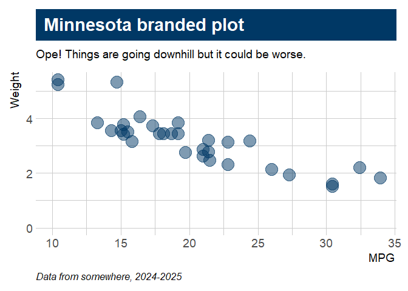
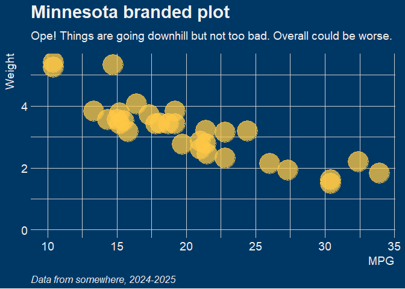
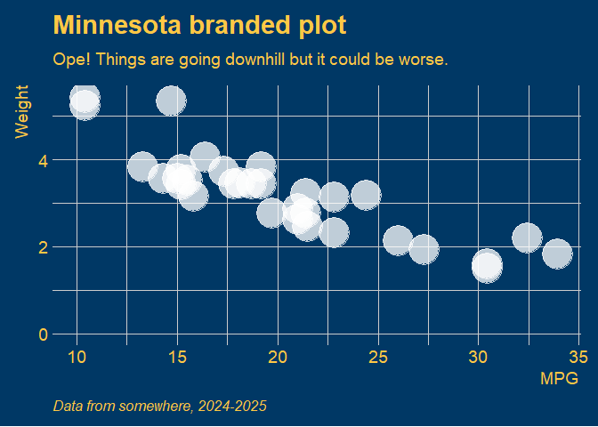
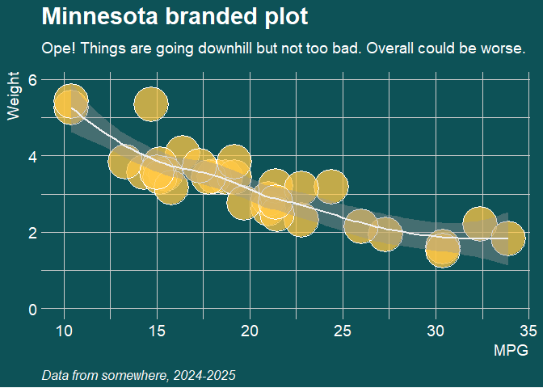
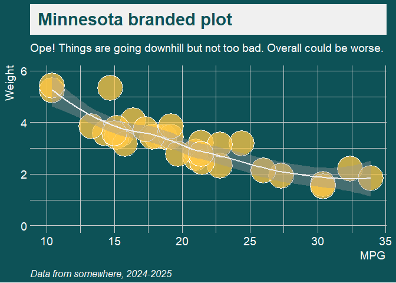
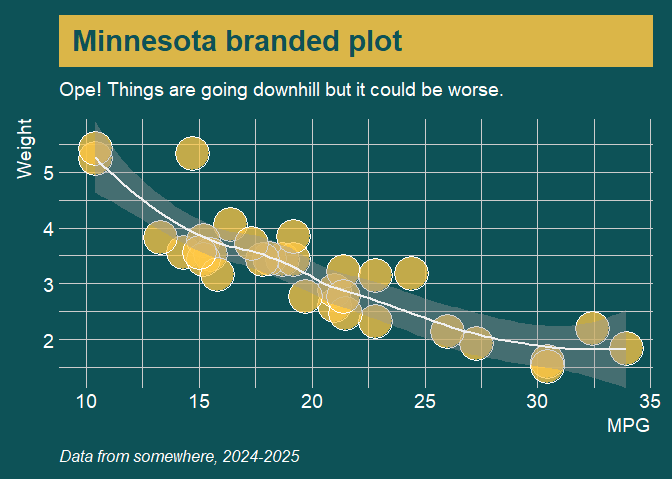
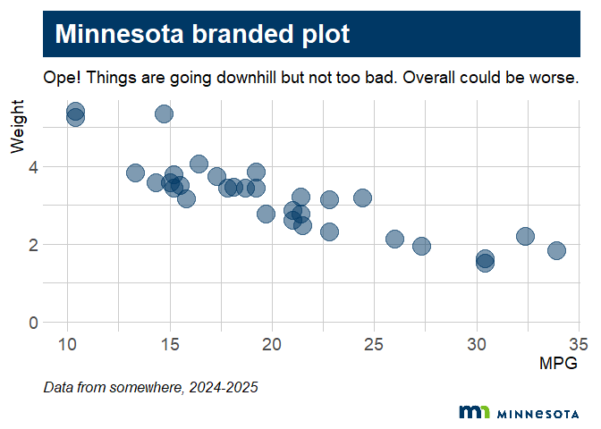
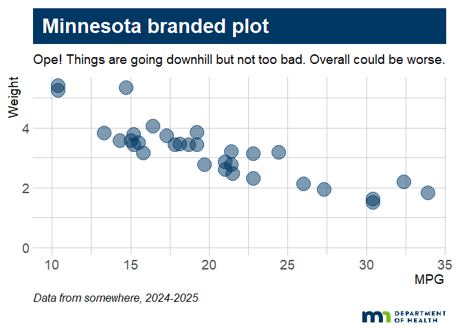
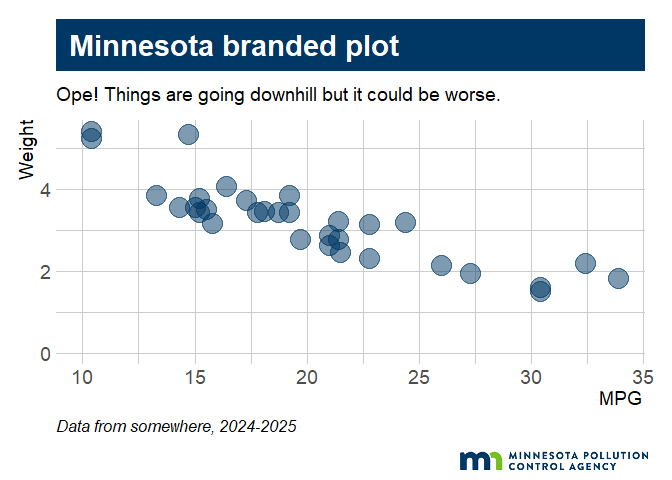
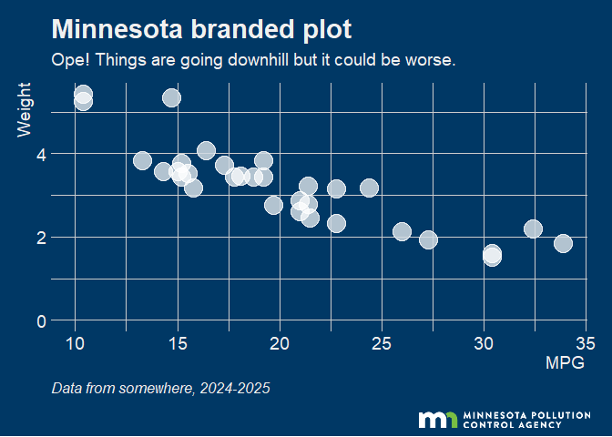

# mnthemes


[](https://lifecycle.r-lib.org/articles/stages.html#experimental)

Minnesota state brand themes and helper functions for ggplot2. Includes
default styles and state agency logos.

------------------------------------------------------------------------

## Installation

You can install the development version from GitHub:

``` r
# install.packages("remotes")
remotes::install_github("tidy-MN/mnthemes")
```

------------------------------------------------------------------------

## Features

- **Themes**: Minnesota branded themes (`theme_mn()`, `theme_mn_dark()`,
  …)  
- **Logos**: Add agency logo to plot (`add_mn_logo()`,
  `add_mn_logo("MPCA")`)

------------------------------------------------------------------------

## Examples

### `theme_mn()`

``` r
p <- ggplot(mtcars, aes(x = mpg, y = wt), ) + 
      labs(title = "Minnesota branded plot",
           subtitle = "Ope! Things are going downhill but it could be worse.",
           caption = "Data from somewhere, 2024-2025",
           x = "MPG",
           y = "Weight") +
      lims(x = c(10, NA), y = c(0, NA)) 

p + 
  geom_point(color = "#003865", size = 7, alpha = 0.5) +
  theme_mn()
```



### `theme_mn_dark()`

``` r
p + 
  geom_point(color = mn_color("gold"), size = 12, alpha = 0.75) + #"#F0F0F0"
  theme_mn_dark()
```



### `theme_mn_dark()` - Gold

``` r
p + 
  geom_point(color = "white", size = 12, alpha = 0.75) + #"#F0F0F0"
  theme_mn_dark(text_color = mn_color("gold"))
```



### `theme_mn_dark()` - Green

``` r
p + 
  geom_point(color = "white", fill = scales::alpha(mn_color("gold"), 0.75),
             size = 15, shape = 21) + 
  geom_smooth(color = mn_color("offwhite")) +
  theme_mn_dark(bg_color = "accent green", text_color = "white")
```



### `theme_mn_dark()` - Green \| White banner

``` r
p + 
  geom_point(color = "white", fill = scales::alpha(mn_color("gold"), 0.75),
             size = 15, shape = 21) + 
  geom_smooth(color = mn_color("offwhite")) +
  theme_mn_dark(bg_color = "accent green", 
                text_color = "white",
                banner = TRUE,
                banner_color = "offwhite",
                banner_text_color = "accent green")
```



### `theme_mn_dark()` - Green \| Gold banner

``` r
p + 
  geom_point(color = "white", fill = scales::alpha(mn_color("gold"), 0.75),
             size = 12, shape = 21) + 
  geom_smooth(color = mn_color("offwhite")) +
  theme_mn_dark(bg_color = "accent green", 
                text_color = "white",
                banner = TRUE,
                banner_color = "gold",
                banner_text_color = "accent_green",
                banner_alpha = 0.85) +
  scale_y_continuous(expand = expansion(mult = c(0.001, 0.01)))
```



### With logo

``` r
p <- p + 
     geom_point(color = "#003865", size = 7, alpha = 0.5) +
     theme_mn() 

p |> add_mn_logo()
```



``` r
p |> add_mn_logo("mdh", logo_width = 0.18)
```



``` r
p |> add_mn_logo("mpca", logo_width = 0.28)
```



``` r
## Dark mode logos
p <- p + 
  geom_point(color = mn_color("white"), size = 7, alpha = 0.7) + 
  theme_mn_dark()

p |> add_mn_logo("mpca-inverse", logo_width = 0.28, bg_color = "blue")
```



------------------------------------------------------------------------

## MN color names

Use `mn_color("blue")` to get a MN brand color’s HEX code. You can use
the color names in any of the `mntheme` functions and they will convert
the names to the HEX code for you.

Example:

``` r
plot + theme_mn_dark(text_color = "teal")
```

| COLOR_NAME | HEX_CODE | COLOR |
|----|----|----|
| mn blue | \#003865 | <span style="display:inline-block;width:40px;height:20px;background-color:#003865;border:1px solid #000;"></span> |
| blue | \#003865 | <span style="display:inline-block;width:40px;height:20px;background-color:#003865;border:1px solid #000;"></span> |
| mn green | \#78BE21 | <span style="display:inline-block;width:40px;height:20px;background-color:#78BE21;border:1px solid #000;"></span> |
| green | \#78BE21 | <span style="display:inline-block;width:40px;height:20px;background-color:#78BE21;border:1px solid #000;"></span> |
| accent teal | \#008EAA | <span style="display:inline-block;width:40px;height:20px;background-color:#008EAA;border:1px solid #000;"></span> |
| teal | \#008EAA | <span style="display:inline-block;width:40px;height:20px;background-color:#008EAA;border:1px solid #000;"></span> |
| accent green | \#0D5257 | <span style="display:inline-block;width:40px;height:20px;background-color:#0D5257;border:1px solid #000;"></span> |
| accent orange | \#8D3F2B | <span style="display:inline-block;width:40px;height:20px;background-color:#8D3F2B;border:1px solid #000;"></span> |
| accent purple | \#5D295F | <span style="display:inline-block;width:40px;height:20px;background-color:#5D295F;border:1px solid #000;"></span> |
| accent blue gray | \#A4BCC2 | <span style="display:inline-block;width:40px;height:20px;background-color:#A4BCC2;border:1px solid #000;"></span> |
| blue gray | \#A4BCC2 | <span style="display:inline-block;width:40px;height:20px;background-color:#A4BCC2;border:1px solid #000;"></span> |
| accent cream | \#F5E1A4 | <span style="display:inline-block;width:40px;height:20px;background-color:#F5E1A4;border:1px solid #000;"></span> |
| cream | \#F5E1A4 | <span style="display:inline-block;width:40px;height:20px;background-color:#F5E1A4;border:1px solid #000;"></span> |
| accent sky blue | \#9BCBEB | <span style="display:inline-block;width:40px;height:20px;background-color:#9BCBEB;border:1px solid #000;"></span> |
| sky blue | \#9BCBEB | <span style="display:inline-block;width:40px;height:20px;background-color:#9BCBEB;border:1px solid #000;"></span> |
| accent gold | \#FFC845 | <span style="display:inline-block;width:40px;height:20px;background-color:#FFC845;border:1px solid #000;"></span> |
| gold | \#FFC845 | <span style="display:inline-block;width:40px;height:20px;background-color:#FFC845;border:1px solid #000;"></span> |
| dark gray | \#53565A | <span style="display:inline-block;width:40px;height:20px;background-color:#53565A;border:1px solid #000;"></span> |
| gray | \#53565A | <span style="display:inline-block;width:40px;height:20px;background-color:#53565A;border:1px solid #000;"></span> |
| medium gray | \#97999B | <span style="display:inline-block;width:40px;height:20px;background-color:#97999B;border:1px solid #000;"></span> |
| light gray | \#D9D9D6 | <span style="display:inline-block;width:40px;height:20px;background-color:#D9D9D6;border:1px solid #000;"></span> |
| white | \#FFFFFF | <span style="display:inline-block;width:40px;height:20px;background-color:#FFFFFF;border:1px solid #000;"></span> |
| offwhite | \#F0F0F0 | <span style="display:inline-block;width:40px;height:20px;background-color:#F0F0F0;border:1px solid #000;"></span> |
| off white | \#F0F0F0 | <span style="display:inline-block;width:40px;height:20px;background-color:#F0F0F0;border:1px solid #000;"></span> |
| black | \#000000 | <span style="display:inline-block;width:40px;height:20px;background-color:#000000;border:1px solid #000;"></span> |
| red | \#A6192E | <span style="display:inline-block;width:40px;height:20px;background-color:#A6192E;border:1px solid #000;"></span> |
| orange | \#E57200 | <span style="display:inline-block;width:40px;height:20px;background-color:#E57200;border:1px solid #000;"></span> |

------------------------------------------------------------------------

## Logo options

You can add an organization’s logo to a plot by passing a logo short
name to `add_mn_logo()`.

Example:

``` r
plot %>% add_mn_logo("mdh")
```

| NAME | LOGO |
|----|----|
| horizontal |  |
| primary |  |
| primary-inverse | <span style="background-color:#003865;padding:4px;display:inline-block;"></span> |
| mdh |  |
| mdh-inverse | <span style="background-color:#003865;padding:4px;display:inline-block;"></span> |
| mdh-tall |  |
| mdh-tall-inverse | <span style="background-color:#003865;padding:4px;display:inline-block;"></span> |
| mpca |  |
| mpca-inverse | <span style="background-color:#003865;padding:4px;display:inline-block;"></span> |

------------------------------------------------------------------------

## Contributing

Contributions welcome! If you’d like to suggest themes or improvements,
open an issue or pull request on GitHub.

------------------------------------------------------------------------

## License

This package is released under the MIT License.

------------------------------------------------------------------------

## Acknowledgements

Built on the shoulders of [ggplot2](https://ggplot2.tidyverse.org/) and
[hrbrthemes](https://github.com/hrbrmstr/hrbrthemes).

------------------------------------------------------------------------
