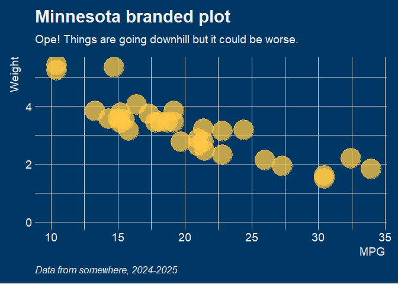
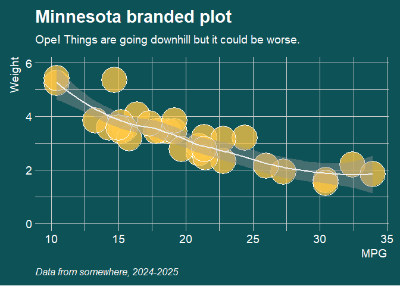
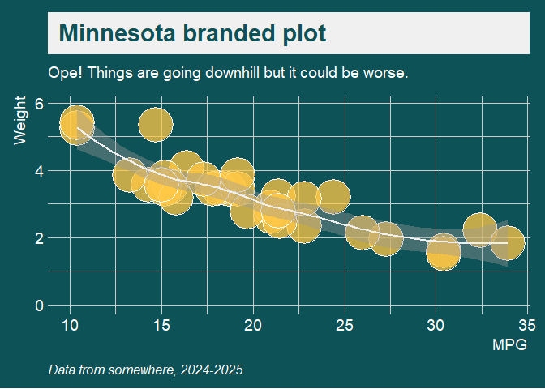
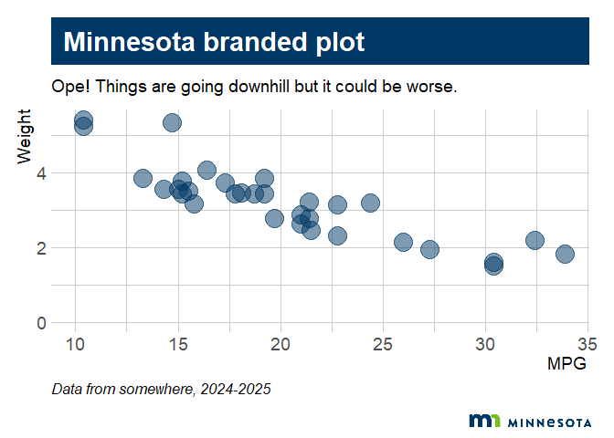
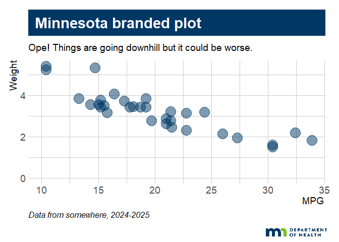
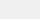
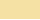
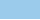

# mnthemes


[](https://lifecycle.r-lib.org/articles/stages.html#experimental)

Minnesota state brand themes and helper functions for ggplot2. Includes
default styles and state agency logos.

------------------------------------------------------------------------

## Installation

You can install the development version from GitHub:

``` r
# install.packages("remotes")
remotes::install_github("tidy-MN/mnthemes")
```

------------------------------------------------------------------------

## Features

- **Themes**: Minnesota branded themes (`theme_mn()`, `theme_mn_dark()`,
  …)  
- **Logos**: Add agency logo to plot (`add_mn_logo()`,
  `add_mn_logo("MPCA")`)

------------------------------------------------------------------------

## Examples

### `theme_mn()`

``` r
p <- ggplot(mtcars, aes(x = mpg, y = wt), ) + 
      labs(title = "Minnesota branded plot",
           subtitle = "Ope! Things are going downhill but it could be worse.",
           caption = "Data from somewhere, 2024-2025",
           x = "MPG",
           y = "Weight") +
      lims(x = c(10, NA), y = c(0, NA)) 

p + 
  geom_point(color = "#003865", size = 7, alpha = 0.5) +
  theme_mn()
```


### `theme_mn_dark()`

``` r
p + 
  geom_point(color = mn_color("gold"), size = 12, alpha = 0.75) + #"#F0F0F0"
  theme_mn_dark()
```



### `theme_mn_dark()` - Gold

``` r
p + 
  geom_point(color = "white", size = 12, alpha = 0.75) + #"#F0F0F0"
  theme_mn_dark(text_color = mn_color("gold"))
```


### `theme_mn_dark()` - Green

``` r
p + 
  geom_point(color = "white", fill = scales::alpha(mn_color("gold"), 0.75),
             size = 15, shape = 21) + 
  geom_smooth(color = mn_color("offwhite")) +
  theme_mn_dark(bg_color = "accent green", text_color = "white")
```



### `theme_mn_dark()` - Green \| White banner

``` r
p + 
  geom_point(color = "white", fill = scales::alpha(mn_color("gold"), 0.75),
             size = 15, shape = 21) + 
  geom_smooth(color = mn_color("offwhite")) +
  theme_mn_dark(bg_color = "accent green", 
                text_color = "white",
                banner = TRUE,
                banner_color = "offwhite",
                banner_text_color = "accent green")
```



### `theme_mn_dark()` - Green \| Gold banner

``` r
p + 
  geom_point(color = "white", fill = scales::alpha(mn_color("gold"), 0.75),
             size = 12, shape = 21) + 
  geom_smooth(color = mn_color("offwhite")) +
  theme_mn_dark(bg_color = "accent green", 
                text_color = "white",
                banner = TRUE,
                banner_color = "gold",
                banner_text_color = "accent_green",
                banner_alpha = 0.85) +
  scale_y_continuous(expand = expansion(mult = c(0.001, 0.01)))
```


### With logo

``` r
p <- p + 
     geom_point(color = "#003865", size = 7, alpha = 0.5) +
     theme_mn() 

p |> add_mn_logo()
```



``` r
p |> add_mn_logo("mdh", logo_width = 0.18)
```



``` r
p |> add_mn_logo("mpca", logo_width = 0.28)
```


``` r
## Dark mode logos
p <- p + 
  geom_point(color = mn_color("white"), size = 7, alpha = 0.7) + 
  theme_mn_dark()

p |> add_mn_logo("mpca-inverse", logo_width = 0.28, bg_color = "blue")
```


------------------------------------------------------------------------

## MN color names

Use `mn_color("blue")` to get a MN brand color’s HEX code. You can use
the color names in any of the `mntheme` functions and they will convert
the names to the HEX code for you.

Example:

``` r
plot + theme_mn_dark(text_color = "teal")
```

| COLOR_NAME       | HEX_CODE | COLOR                                            |
|------------------|----------|--------------------------------------------------|
| mn blue          | \#003865 |                    |
| blue             | \#003865 |                          |
| mn green         | \#78BE21 |                  |
| green            | \#78BE21 |                        |
| white            | \#FFFFFF |                        |
| offwhite         | \#F0F0F0 |                  |
| off white        | \#F0F0F0 |                |
| black            | \#000000 |                        |
| accent teal      | \#008EAA |            |
| teal             | \#008EAA |                          |
| accent green     | \#0D5257 |          |
| accent orange    | \#8D3F2B |        |
| accent purple    | \#5D295F |        |
| accent blue gray | \#A4BCC2 |  |
| blue gray        | \#A4BCC2 |                |
| accent cream     | \#F5E1A4 |          |
| cream            | \#F5E1A4 |                        |
| accent sky blue  | \#9BCBEB |    |
| sky blue         | \#9BCBEB |                  |
| accent gold      | \#FFC845 |            |
| gold             | \#FFC845 |                          |
| dark gray        | \#53565A |                |
| gray             | \#53565A |                          |
| medium gray      | \#97999B |            |
| light gray       | \#D9D9D6 |              |
| red              | \#A6192E |                            |
| orange           | \#E57200 |                      |

------------------------------------------------------------------------

## Logo options

You can add an organization’s logo to a plot by passing a logo short
name to `add_mn_logo()`.

Example:

``` r
plot %>% add_mn_logo("mdh")
```

| NAME | LOGO |
|----|----|
| horizontal |  |
| primary |  |
| primary-inverse | <span style="background-color:#003865;padding:4px;display:inline-block;"></span> |
| mdh |  |
| mdh-inverse | <span style="background-color:#003865;padding:4px;display:inline-block;"></span> |
| mdh-tall |  |
| mdh-tall-inverse | <span style="background-color:#003865;padding:4px;display:inline-block;"></span> |
| mpca |  |
| mpca-inverse | <span style="background-color:#003865;padding:4px;display:inline-block;"></span> |

------------------------------------------------------------------------

## Contributing

Contributions welcome! If you’d like to suggest themes or improvements,
open an issue or pull request on GitHub.

------------------------------------------------------------------------

## License

This package is released under the MIT License.

------------------------------------------------------------------------

## Acknowledgements

Built on the shoulders of [ggplot2](https://ggplot2.tidyverse.org/) and
[hrbrthemes](https://github.com/hrbrmstr/hrbrthemes).

------------------------------------------------------------------------
